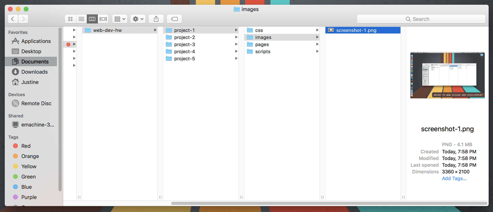

## Staying Organized:
▶ &nbsp;▶  &nbsp;▶

Maintaining organized files and consistent folder structure is key to creating effective workflow. This is especially important in web development because a URL contains **paths** which effectively provide directions to your files. Improperly cataloguing or even naming these files can lead to complete failure in loading your site.

### Files
Web designers use all types of files to create sites, from `.html` to `.css` to `.php` and dozens of others. How files are created and saved will affect how they are processed; a `.css` file will not have the same capabilities of a `.html` file, and vice versa. Most file types and their languages are designed to work _together,_ not singularly, and need to be directed to each other.

### Folders
We organize these different files into groups, just like you do with your other non-web-based files. We commonly refer to the containers of these files as "folders," because that's exactly as they function; folios containing related files. In addition, most operating systems represent these folders with graphic icons (folders), so its reasonable that we call them that.

But once we branch away from our desktop however, this term is a little less applicable. Consider this URL:

https://www.mcdonalds.com/content/dam/usa/logo/m_logo.png

The path for this image, `/content/dam/usa/logo` actually refers to the nesting of its folders, or **directories**. "Folders" and "directories" refer to the same concept, but "directory" should be used when discussion file systems. You will hear us use directory most often.

Please watch the video below, which does a very good job of describing proper file structure for creating websites. **Pay special attention to file-naming conventions.**

 

<iframe class="embed-responsive-item" src="https://www.youtube.com/embed/RniGO9Ek6yY" frameborder="0" allowfullscreen></iframe>

 

### /web-dev-hw
You need to make a new folder on your local drive for your homework. This is the directory that will synch with your GitHub account. Watch the video under the **{TODO:}** lable to continue.

# { TODO: }

<iframe class="embed-responsive-item" src="https://player.vimeo.com/video/232282708?color=1CCDCA&title=0&byline=0&portrait=0" frameborder="0" allowfullscreen></iframe>

Plese ignore my liberal use of the word "document." "File" is the appropriate term.

1. Create a directory structure on your local hard-drive, with appropriate sub-directories (sub-folders).
2. Include a re-named screenshot in your /images folder for your "Project-1" directory. We will use this image later on in your first `readme.md`. Here's a visual re-cap:

**../web-dev-hw/project-1/images/screenshot-1.png**
