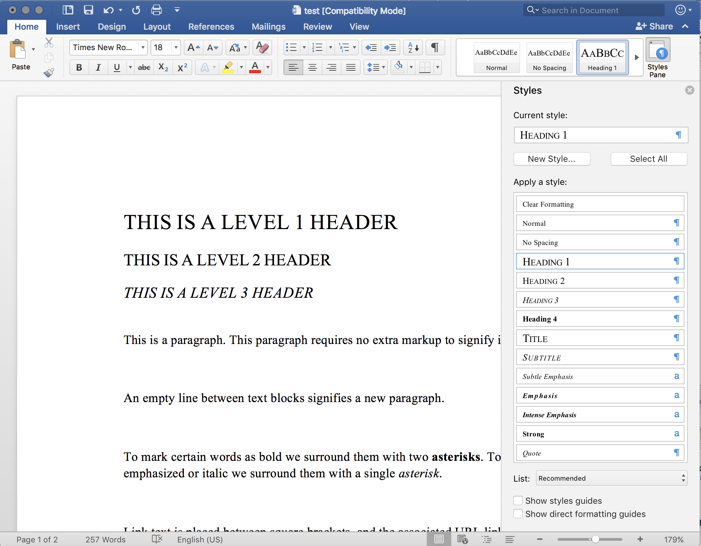

## Marking Things Up, Down, and All Around:
▶ &nbsp;▶  &nbsp;▶

A **markup language** is a system for annotating a document in a way that is syntactically distinguishable from the text. Markup languages tend to encourage writers to focus on _content_ and _structure_ before concerning themselves with presentation.

Structure is defined for a processor through the use of tags embedded directly in the text.

One of the original markup languages, and one which you will be using extensively as a web developer during this course is HTML or HyperText Markup Language. But to start, let's look at another, slightly simpler, and very popular markup language known as **Markdown.**

### Markdown
Just as in HTML, markdown files encourage the writer to focus on content and structure, as opposed to formatting. In fact, this entire course has been developed for the web using markdown files. In other words, at this very moment, you are reading a markdown file.

A markdown file typically uses the `.md` extension. This file type allows the writer to identify portions of the text as headers (at various levels), paragraphs, bold, italic, links, code, lists, and tables. It also allows the writer to easily include images through links in the document. Below is an example of markdown.

#### Difference between Microsoft Word and markdown?
As mentioned previously, one of the main differences between a a markdown (or more generally, text document) and a Microsoft Word file is that the former is stored as text, and the latter is stored as binary code. Microsoft does this for a number of reasons, one of these is to keep their product proprietary. This binary file also allows for syntax and structure to be stored within the document file, without the user having to see it in the text itself.

The image below shows a word document in which certain sections have been styled using Word’s “styles”.

# { TODO: }
You can play around with all of our Codepen embeds by clicking on their "Edit in Codepen" links.

You should consider doing this each time you see one. Take a minute or two and experiement in Markdown by utilizing this page's Pen.
