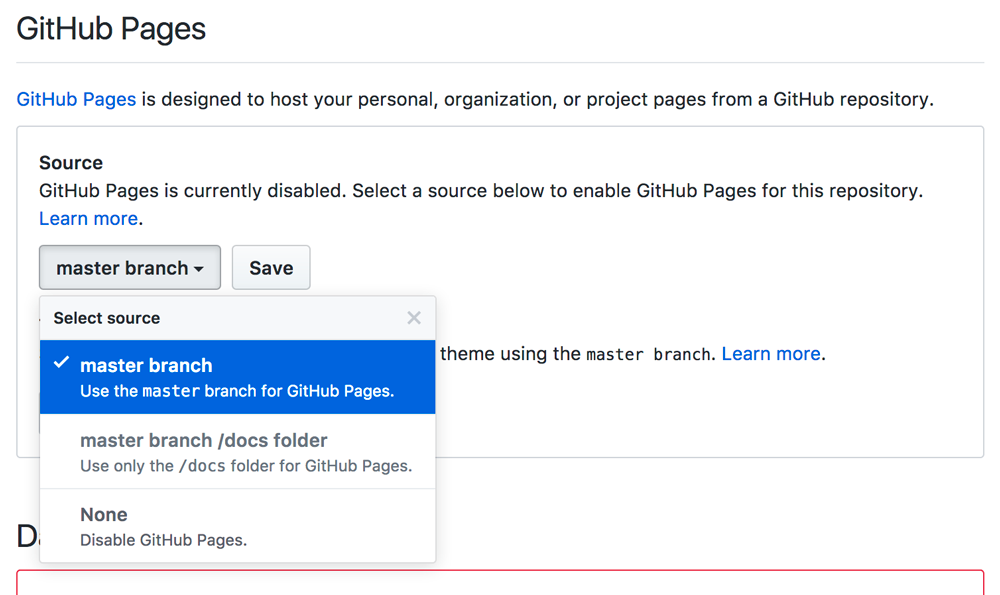
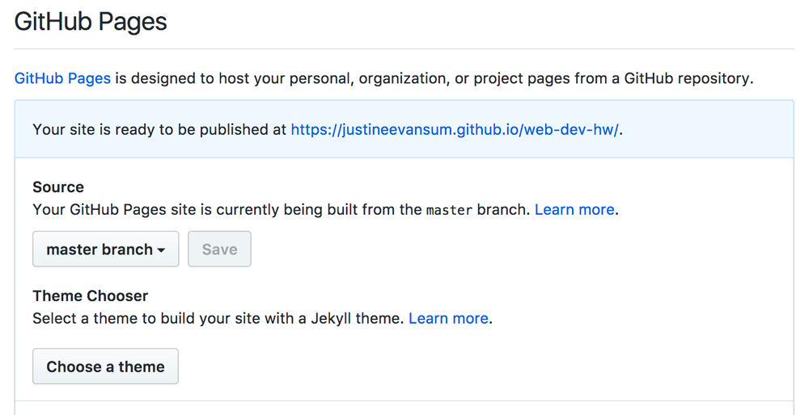
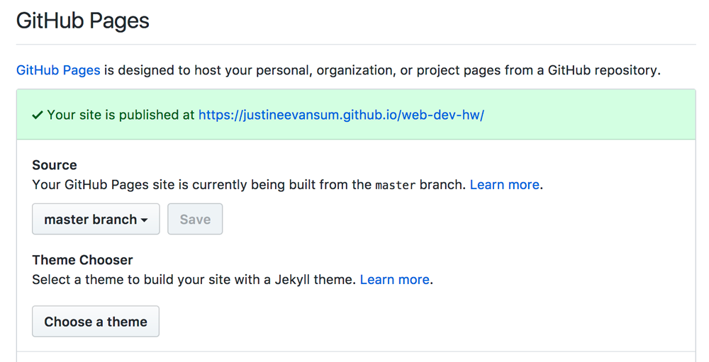
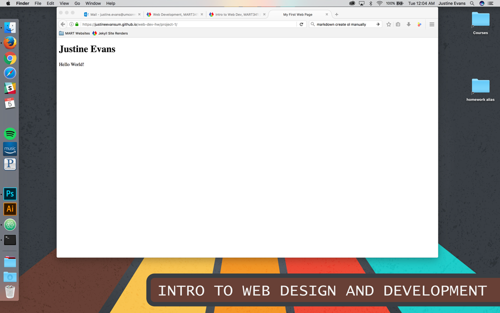

## Showing the World:  Going Live
▶ &nbsp;▶  &nbsp;▶

OK, congratulations on writing your first html code/page. Now, lets figure out how to get it on the Internet for others to view.

We are going to need to acquire server space, this is where we will store our files. Furthermore, this server will actually “serve” these files to requesting host-computers. In addition to acquiring a server, we will need to each get individual and unique URL’s where we can point a computer to.

## Creating a Website with GitHub-Pages
GitHub.com provides free web hosting for static websites (a static site is one that does not involve server-side computational work beyond serving or delivering files to a requesting host-computer). For this course, this means we can utilize them as a our server, and they will also provide us with URLs!

GitHub assigns each user the following URL:
_username_`.github.io`

This is your _baseurl:_

<iframe class="embed-responsive-item" src="https://www.youtube.com/embed/2MsN8gpT6jY" frameborder="0" allowfullscreen></iframe>

# { TODO: }  Make Our Repo a Webpage

In order for our repo to be served, we need to tell GitHub that this is a “GitHub pages project site."

1. Go to your GitHub.com account.
2. Click into your `/web-dev-hw` repository.
3. Select the Settings tab for the repo.

4. Scroll down to the “GitHub Pages” section. And under “Source” select “master branch” then click save. 
5. You should then see this section change and say that your site is “ready to be published as …”. This means GitHub is processing your site and publishing it, assuming no errors popup.

6. Wait a few minutes and reload that page. Eventually this section should turn green, meaning it is Live!

7. Click on the link there. It of course will not work since we have not placed an `index.html` file in the root directory of the repo. Instead you should see a GitHub “404 error page” or your root `README.md` if you created one.
8. We simply need to add the directory where our new `index.html` file lives in our repo. Select the URL in the address bar, and add `project-1/` to the end of the address. This should open up your `index.html` page at an address that looks like `https://yourusername.github.io/web-dev-hw/project-1/`.

For all of the future pages you will write for homework, the URL will be `https://yourusername.github.io/341-work/` + `the-homework-directory` you are currently working in.

# { TODO: }
1. Go back to your `/web-dev-hw` repo. Click Edit, and paste in this new URL to your GitHub pages live site. (This will help you keep track of it.)

2. Show all your friends.
